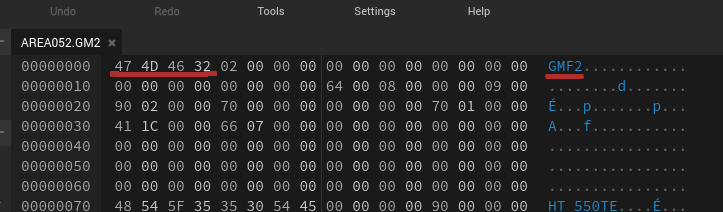

# File Format Index

??? info "File signatures" 
    Most of the listed file formats start with a magic number to make them easier to identify. You can check the file signature with a hex editor:  
    Go to [hexed.it](https://hexed.it), open a file, and see what the first bytes spell out.

    

| ID / Name                  | File Ext.     | Category | Description        | Games                                                                                  |
| -------------------------- | ------------- | -------- | ------------------ | -------------------------------------------------------------------------------------- |
| [**`FLCG`**](flcg)         | `.gcl`        | Models   | Collisions meshes  | [`NMH`](/ghm_docs/games/NMH) [`NMH2`](/ghm_docs/games/NMH2)                            |
| **`GAN2`**                 | `.bin` `.ga2` | Anim     |                    | [`NMH`](/ghm_docs/games/NMH) [`NMH2`](/ghm_docs/games/NMH2)                            |
| [**`GCT0`**](gct0)         | `.bin` `.gct` | Texture  | GHM texture format | [`K7`](/ghm_docs/games/K7) [`NMH`](/ghm_docs/games/NMH) [`NMH2`](/ghm_docs/games/NMH2) |
| [**`GMF2`**](gmf2)         | `.gm2`        | Model    |                    | [`NMH`](/ghm_docs/games/NMH) [`NMH2`](/ghm_docs/games/NMH2)                            |
| [**`RMHG`**](rmhg)         | `.pak` `.rsl` | Archive  |                    | [`K7`](/ghm_docs/games/K7) [`NMH`](/ghm_docs/games/NMH) [`NMH2`](/ghm_docs/games/NMH2) |
| **`RSAR`**                 | `.brsar`      | Audio    | Wii audio archive. | [`NMH`](/ghm_docs/games/NMH) [`NMH2`](/ghm_docs/games/NMH2)                            |
| **`RSTM`**                 | `.brstm`      | Audio    | Wii audio stream.  | [`NMH`](/ghm_docs/games/NMH) [`NMH2`](/ghm_docs/games/NMH2)                            |
| **`SEST`**                 | `.bin`        | Audio    | SFX table          | [`NMH`](/ghm_docs/games/NMH) [`NMH2`](/ghm_docs/games/NMH2)                            |
| **`STMD`**                 | `.bin`        | Audio    | SFX timing?        | [`NMH`](/ghm_docs/games/NMH) [`NMH2`](/ghm_docs/games/NMH2)                            |
| **`STSD`**                 | `.bin`        | Audio    | SFX                | [`NMH`](/ghm_docs/games/NMH) [`NMH2`](/ghm_docs/games/NMH2)                            |
| [**`STRIMAG2`**](strimag2) | `.bin`        | Font     |                    | [`K7`](/ghm_docs/games/K7) [`NMH`](/ghm_docs/games/NMH) [`NMH2`](/ghm_docs/games/NMH2) |
| **`THP`**                  | `.bin`        | Video    | Movies             | [`NMH`](/ghm_docs/games/NMH) [`NMH2`](/ghm_docs/games/NMH2)                            |
| .dat (GC)                  | `.dat`        | Model    | GC model format    | [`K7`](/ghm_docs/games/K7)                                                             |

This list is non-exhaustive.